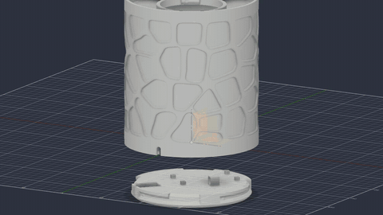
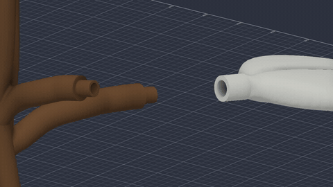
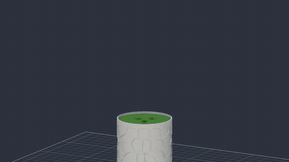

<div align="center">

# Yggdrasill

**Smart LED plant pot** — custom ESP32 PCB, addressable LEDs, WLED firmware, a modular 3D-printed vase, and a native iOS app with Apple's Liquid Glass design.

[](https://creativecommons.org/licenses/by-nc-sa/4.0/)
[](WLED-iOS/LICENSE)
[](docs/ios-app.md)
[](docs/hardware.md)



</div>

---

## What it is

A tree-shaped plant pot built from three independent pieces that come together into one object:

<table>
<tr>
<td width="33%" valign="top">

### Hardware
`PCB/`

ESP32 board driving WS2812B / SK6812 addressable LEDs. 4 variants in KiCad, from a full dev-kit to a bare-chip revision.

</td>
<td width="33%" valign="top">

### 3D print
`3D/`

Modular vase — base, lid, trunk, 3 branches, leaves — joined with bayonet/snap-fit joints. FDM-printable in PETG or PLA.

</td>
<td width="33%" valign="top">

### iOS app
`WLED-iOS/`

Liquid Glass redesign (iOS 26) of a WLED controller. mDNS discovery, WebSocket control.

</td>
</tr>
</table>

---

## Assembly preview

<table>
<tr>
<td align="center" width="50%"><b>Leaf insertion</b></td>
<td align="center" width="50%"><b>Branch assembly</b></td>
</tr>
<tr>
<td></td>
<td></td>
</tr>
</table>

---

## Status

| Component | Status |
|---|---|
| BaseChipOnly PCB (rev 1.03+) | Active — **recommended** |
| BaseDevKit PCB | Active |
| BaseUSB-C rev0.1 PCB | Early revision |
| Foglia PCB | Active |
| Modular vase (`3D/STL_stampa/`) | Redesigned as modular parts — fit clearances and bayonet joints not yet verified by a physical print |
| iOS app (Liquid Glass) | In development |

---

## Quick start

### Hardware

Gerber files are in `PCB/<variant>/Esportazione/`. Upload to JLCPCB or PCBWay.
Open the KiCad project in **KiCad 8+** for schematic / PCB editing.
See [docs/hardware.md](docs/hardware.md) for the full variant table and BOM.

### 3D printing

Print-ready STLs are in `3D/STL_stampa/`. PETG recommended, 0.2 mm layers.
See [docs/3d-printing.md](docs/3d-printing.md) for orientation and joint-clearance notes.

### iOS app

Requires **Xcode 16+** and an **iOS 26+** device or simulator.

```bash
git clone --recurse-submodules https://github.com/YOUR/Yggdrasill
open WLED-iOS/wled.xcodeproj
```

> Note: `WLED-iOS/` submodule link is set up once the fork is published on GitHub.

---

## Repository structure

```
Yggdrasill/
├── PCB/               KiCad projects — 4 board variants + footprint library
├── 3D/                Modular vase — Vaso/ (Fusion source + STEP + animations), STL_stampa/ (print-ready STLs)
├── WLED-iOS/          iOS app (Liquid Glass, GPL v3) — future git submodule
├── docs/              Hardware, iOS, 3D, and assembly documentation
│   └── hardware-reviews/  PCB analysis notes
├── LICENSE            CC BY-NC-SA 4.0 (hardware + 3D)
├── LICENSE-NOTICES.md Dual-license clarification
├── CHANGELOG.md
└── CONTRIBUTING.md
```

---

## Documentation

- [Hardware variants & BOM](docs/hardware.md)
- [iOS app architecture & Liquid Glass](docs/ios-app.md)
- [3D printing guide](docs/3d-printing.md)
- [Assembly guide](docs/assembly.md)
- [BaseChipOnly hardware review](docs/hardware-reviews/base-chiponly-review.md)

---

## License

**Hardware & 3D models** (`PCB/`, `3D/`, `docs/`) — Creative Commons Attribution-NonCommercial-ShareAlike 4.0 International, Copyright (c) 2025 Marco Barlera. Free for personal and maker use; commercial use requires explicit written permission.
See [LICENSE](LICENSE) · [creativecommons.org/licenses/by-nc-sa/4.0](https://creativecommons.org/licenses/by-nc-sa/4.0/)

**iOS app** (`WLED-iOS/`) — GNU General Public License v3.0, inherited from [Moustachauve/WLED-iOS](https://github.com/Moustachauve/WLED-iOS). Copyleft; cannot be changed.
See [WLED-iOS/LICENSE](WLED-iOS/LICENSE)

Full dual-license details: [LICENSE-NOTICES.md](LICENSE-NOTICES.md)

---

<div align="center">

**Marco Barlera** — [marcobarlera.com](https://marcobarlera.com) — barleramarco05@gmail.com

Commercial licensing inquiries: contact via email.

</div>
